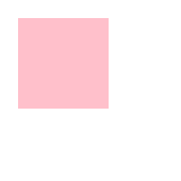
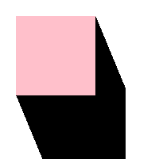

# Examples

## gfx.DrawShadows

| Polygon (gfx.Rec)                | Shadows                         | Combined                          |
| -------------------------------- | ------------------------------- | --------------------------------- |
|  |  |  |
